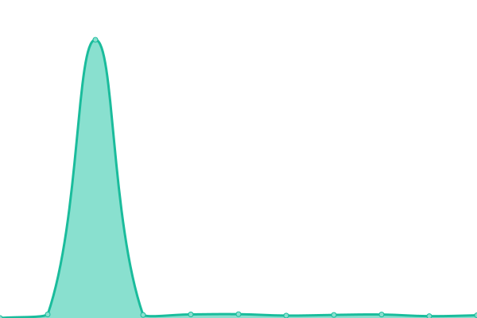

# [📈 Live Status](https://uptime.gohighlevel.site): <!--live status--> **🟩 All systems operational**

This repository contains the open-source uptime monitor and status page for [HighLevel-status](https://uptime.gohighlevel.site), powered by [Upptime](https://github.com/upptime/upptime).

With [Upptime](https://upptime.js.org), you can get your own unlimited and free uptime monitor and status page, powered entirely by a GitHub repository. We use [Issues](https://github.com/HighLevel-status/upptime/issues) as incident reports, [Actions](https://github.com/HighLevel-status/upptime/actions) as uptime monitors, and [Pages](https://uptime.gohighlevel.site) for the status page.

<!--start: status pages-->
<!-- This summary is generated by Upptime (https://github.com/upptime/upptime) -->
<!-- Do not edit this manually, your changes will be overwritten -->
<!-- prettier-ignore -->
| URL | Status | History | Response Time | Uptime |
| --- | ------ | ------- | ------------- | ------ |
|  [HighLevel](https://www.gohighlevel.com) | 🟩 Up | [high-level.yml](https://github.com/HighLevel-Status/uptime/commits/HEAD/history/high-level.yml) | 

 218ms
     
 | 

<a href="https://uptime.gohighlevel.site/history/high-level">100.00%</a>
    

|  [HighLevel Forms](https://msgsndr.com/widget/form/U5I9kPNNNEScZ6fyhYCt) | 🟩 Up | [high-level-forms.yml](https://github.com/HighLevel-Status/uptime/commits/HEAD/history/high-level-forms.yml) | 

 448ms
     
 | 

<a href="https://uptime.gohighlevel.site/history/high-level-forms">100.00%</a>
    

|  [HighLevel Contacts](https://services.leadconnectorhq.com/appengine/health-status/es-contact-list) | 🟩 Up | [high-level-contacts.yml](https://github.com/HighLevel-Status/uptime/commits/HEAD/history/high-level-contacts.yml) | 

 143ms
     
 | 

<a href="https://uptime.gohighlevel.site/history/high-level-contacts">100.00%</a>
    

|  [HighLevel Opportunity List](https://services.leadconnectorhq.com/appengine/health-status/es-opportunity-list) | 🟩 Up | [high-level-opportunity-list.yml](https://github.com/HighLevel-Status/uptime/commits/HEAD/history/high-level-opportunity-list.yml) | 

 118ms
     
 | 

<a href="https://uptime.gohighlevel.site/history/high-level-opportunity-list">100.00%</a>
    

|  [HighLevel Memberships](https://services.leadconnectorhq.com/membership/) | 🟩 Up | [high-level-memberships.yml](https://github.com/HighLevel-Status/uptime/commits/HEAD/history/high-level-memberships.yml) | 

 54ms
     
 | 

<a href="https://uptime.gohighlevel.site/history/high-level-memberships">34.73%</a>
    

|  [Highlevel App](https://app.gohighlevel.com) | 🟩 Up | [highlevel-app.yml](https://github.com/HighLevel-Status/uptime/commits/HEAD/history/highlevel-app.yml) | 

 243ms
     
 | 

<a href="https://uptime.gohighlevel.site/history/highlevel-app">0.23%</a>
    

<!--end: status pages-->

[**Visit our status website →**](https://uptime.gohighlevel.site)

## 📄 License

- Powered by: [Upptime](https://github.com/upptime/upptime)
- Code: [MIT](./LICENSE) © [Anand Chowdhary](https://anandchowdhary.com), supported by [Pabio](https://pabio.com)
- Data in the `./history` directory: [Open Database License](https://opendatacommons.org/licenses/odbl/1-0/)
